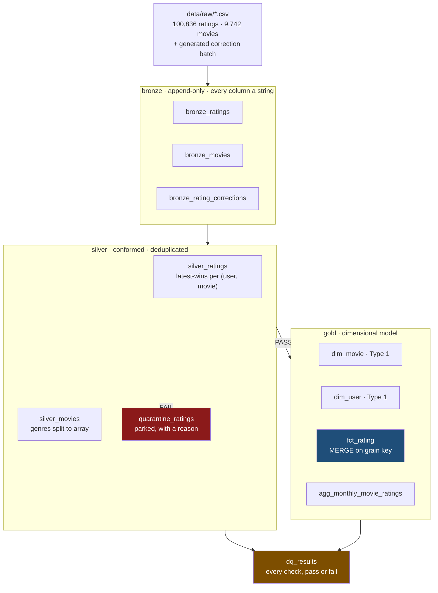

# Delta Lake Medallion Lakehouse

A bronze → silver → gold lakehouse on **Delta Lake** and **PySpark**, orchestrated
by **Airflow**, with a quality gate that blocks promotion between layers.

Runs locally on WSL2. No Databricks account, no cloud bill, no Docker.

---

## What this project is actually about

The interesting property of Delta Lake is not that it is fast. It is that a
**correction is a normal event** rather than a crisis.

When a rating is restated, three things have to be true at once: the new value
has to replace the old one rather than sit beside it as a duplicate; the old
value has to remain recoverable; and a reader must never see a half-applied
update. Parquet gives you none of those. Delta gives all three, and this project
exists to demonstrate them on data where you can see the effect.

Everything below is reproducible from an empty directory.

---

## Architecture



Airflow runs the stages as separate tasks with the gate as its own step:

```
fetch_raw_data → bronze_ingest → silver_conform → silver_quality_gate
                                                            ↓ (blocked on failure)
                                              gold_merge_fact → gold_quality_gate
```

---

## Results

| Layer | Rows |
|---|---:|
| `bronze_ratings` (per run, append-only) | 100,836 |
| `bronze_movies` | 9,742 |
| `bronze_rating_corrections` | 44 |
| `silver_ratings` | **100,835** |
| `silver_movies` | 9,742 |
| `quarantine_ratings` (per run) | 4 |
| `dim_movie` | 9,742 |
| `dim_user` | 610 |
| `fct_rating` | **100,835** |
| `agg_monthly_movie_ratings` | 82,147 |

The silver count reconciles exactly, and the reconciliation is the point:

```
100,836 base ratings
+   3 new pairs from orphan corrections
−   1 pair superseded by the out-of-range correction, then quarantined
−   3 orphan pairs, quarantined
= 100,835
```

**10 quality checks** pass, **4 tests** pass (3 fast, 1 Spark integration),
full pipeline **~2 minutes**, Airflow DAG **~4 minutes**.

---

## The three demonstrations

### 1. MERGE upserts instead of appending

```bash
.venv/bin/python -m src.lakehouse.run_pipeline     # run it twice
```

```
run 1: fct_rating: created with 100,835 rows
run 2: fct_rating: MERGEd 100,835 rows (version 0 -> 1)
```

Bronze grows on every run (201,672 rows after two runs) because bronze is
append-only by design. The fact table does not, because MERGE upserts on the
grain key. The `gold_fact_grain_unique` check fails the build if that stops
being true.

### 2. Time travel recovers the pre-correction value

```bash
.venv/bin/python scripts/demo_delta_features.py
```

```
rating now 0.5 → corrected to 5.0, rows unchanged (100,835)
TIME TRAVEL
  version 1 (now)    : rating = 5.0
  version 0 (before) : rating = 0.5
  -> The pre-correction value is still readable.
```

### 3. The gate stops promotion

The correction batch deliberately injects three kinds of bad row on every run:
an out-of-range rating, three ratings for a movie that does not exist, and — via
`make_corrections.py` — nothing that should surprise a reviewer. All are
**parked in `quarantine_ratings` with a reason**, never dropped, and
`quarantine_retained_bad_rows` fails the gate if that table is empty, because an
exclusion you cannot count is not an exclusion you can defend.

---

## How to run

Requires **WSL2** (Airflow does not support native Windows) and about 3 GB of
spare RAM.

```bash
# one-time, inside WSL
wsl --install -d Ubuntu --no-launch        # from PowerShell
sudo apt-get install -y openjdk-17-jdk-headless
bash scripts/install_deps.sh

# every run
bash scripts/run.sh -m src.lakehouse.run_pipeline   # the pipeline
bash scripts/run_dag.sh                             # the same, via Airflow
bash scripts/test.sh                                # fast tests, ~2s
bash scripts/test.sh slow                           # + Spark integration, ~3min
```

### A note on where the data lives

The **code** is on `/mnt/d` so `git` works from Windows. The **warehouse** is on
WSL-native ext4 (`/root/lakehouse`), because Delta commits by writing a JSON file
into `_delta_log` and renaming it — that needs atomic rename plus consistent
directory listing, and the DrvFs mount under `/mnt/d` does not reliably provide
either. Override with `LAKEHOUSE_ROOT` if you want it elsewhere.

---

## Design decisions worth arguing about

**Bronze keeps every column as a string.** Casting on the way in loses the
evidence of what was actually there. If an upstream column changes from `1.0` to
`1,00`, bronze should show you the text and silver should fail loudly, not
silently coerce a number.

**Types are applied once, in silver.** Same reason, stated as a location.

**Corrections are unioned with the primary feed, then deduplicated.** A
correction is not a special kind of record — it is a later truth about the same
key. Unioning first and deduplicating second means the "latest wins" rule lives
in exactly one place instead of being reimplemented per source.

**Referential integrity is enforced in silver, not gold.** Gold's fact inner-joins
to `dim_movie`, which silently drops orphans. An orphan check written against gold
*cannot fail*, because the join has already removed the evidence. The first
version of this project had exactly that bug.

**The quality gate is its own Airflow task.** As a task it gets its own run
history, and "silver built successfully but the gate rejected it" is a different
statement from "silver failed".

**The gold tasks have `retries=0`.** A gate exists to stop bad data reaching
consumers. Retrying downstream work after a gate rejected its input just re-runs
the same work against the same bad input.

**No Great Expectations.** Every check is a named function returning a row, and
the gate is a boolean over those rows. A dependency would add hundreds of
packages to express what fits in a list comprehension, and the interview question
is "what does your gate check and what happens when it fails", not "which
library".

---

## Three bugs this project found in itself

Kept here because "the tests caught it" is a better answer than "it was correct
from the start".

**1. A gate that could not fail.** The orphan check originally ran against gold,
where the inner join to `dim_movie` had already dropped the orphans. It passed
every time because it was structurally incapable of failing. Moved to silver,
where the orphans still exist — and it now has real work to do.

**2. `event_ts` was NULL for all 100,836 rows, and the build was green.** Bronze
stores every column as a string, so `cast("timestamp")` on `"1700000000"` tries to
parse it as a timestamp *literal* — which it is not — and yields NULL rather than
an error. Every other check passed. Two consequences: the "latest record wins"
dedup had no timestamp to order by, so it picked arbitrarily between two
corrections; and nothing noticed. Fixed by casting string → long → timestamp, and
by adding `ratings_event_ts_not_null`, because **a gate only covers the rules
somebody thought to write down**.

**3. A unit error that looked like plausible data.** Multiplying the epoch by
1000 before casting produced dates in 1926 and, for some values, the year 38975.
The first version of the timestamp check caught this — but it then failed the
pipeline for a *correct* reason I had not anticipated: corrections are legitimately
dated after the dataset ends. The bound was widened to 2030 with the reason
written down. A check that is too tight is a check that blocks correct behaviour.

---

## Honest limitations

- **Delta on a local filesystem does not support concurrent transactional writes.**
  Single-writer only. On S3, concurrent writes must originate from one driver.
  This is a real limitation and worth volunteering — most people who run Delta
  locally do not know it exists.
- **100k rows.** Enough to prove the modelling and the Delta semantics; not enough
  to show partition pruning, file-size tuning, or why a 200-way shuffle is
  wasteful (though the config sets 4 partitions precisely because it would be).
- **One Spark session per Airflow task**, ~25s of JVM startup each. Correct given
  Airflow's process isolation, and the isolation is the feature — but it is not
  what you would ship at volume.
- **The correction batch is synthetic, on purpose.** Demonstrating an upsert
  needs data that supersedes an earlier record, and a real dataset will not
  reliably hand you that. It is generated from a fixed seed and byte-identical on
  every run, and `test_corrections_are_deterministic` enforces that.
- **Airflow runs via `airflow dags test`, not `airflow standalone`.** The latter
  starts a scheduler, triggerer, webserver and DAG processor that together want
  more memory than this machine has spare, and none of it is needed to show the
  DAG works. The DAG itself is a normal Airflow DAG.

---

Data: [MovieLens ml-latest-small](https://grouplens.org/datasets/movielens/latest/),
GroupLens, 100,836 ratings across 9,742 movies.
Versions: Airflow 2.10.5 · PySpark 3.5.4 · delta-spark 3.3.0 · Delta Lake 3.3.0 · Python 3.12.